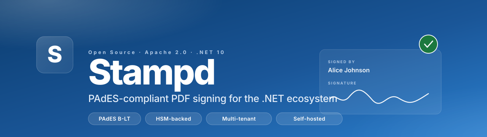

<div align="center">



<br/>

[](https://opensource.org/licenses/Apache-2.0)
[](https://dotnet.microsoft.com/)
[](https://en.wikipedia.org/wiki/PAdES)
[](#)
[](#release-history)

**An executive-grade, open-source e-signature platform built natively for .NET.**

[Quick start](#quick-start) · [Architecture](#architecture) · [Documentation](#documentation) · [Roadmap](#roadmap) · [Contributing](#contributing)

</div>

---

## Why Stampd

The .NET ecosystem has world-class libraries for everything from data access (EF Core) to logging (Serilog) to background work (Hangfire) to resilience (Polly).

It does not have a production-grade open-source e-signature platform.

Today, every .NET shop that needs to embed signing in a product faces the same three bad options:

1. **Pay DocuSign per envelope** — $0.50–$5 per signed PDF. Scales linearly with your customers.
2. **Integrate something written in another stack** — DocuSeal (Ruby) and Documenso (TypeScript) are excellent, but neither is in your language, your package manager, or your tooling.
3. **Build it yourself from scratch** — months of PAdES, ASN.1, CMS, and BouncyCastle to get to a green check in Adobe Acrobat.

Stampd is the option that should have existed.

## Highlights

| | |
|---|---|
| **Cryptographically sound** | PAdES B-B, B-T, B-LT signatures verifiable in Adobe Acrobat. RFC 3161 timestamps. Embedded OCSP + CRL for long-term validity. |
| **HSM-first** | Pluggable sealing providers: local certificate, HashiCorp Vault, OpenBao, Azure Key Vault, AWS KMS. Private keys never leave the HSM. |
| **Multi-cloud storage** | Built-in adapters for local filesystem, S3, Azure Blob, and Google Cloud Storage — your choice, your tenant-prefix policy, your KMS keys. |
| **Multi-provider database** | SQL Server, PostgreSQL, SQLite. EF Core 10 throughout, with global tenant query filters and append-only audit. |
| **Truly open source** | Apache 2.0 across the entire stack. No relicensing clause. No "open-core" feature gate. The thing you fork is the thing we ship. |
| **Executive-grade UI** | Static SSR Blazor signer experience with real PDF.js rendering. Visual template designer. Dark/light theme. Zero dependencies on commercial component libraries. |
| **Production observability** | Serilog structured logging, OpenTelemetry traces + metrics, correlation IDs, real health probes, JWT auth, rate limiting. Ships in a Docker container. |
| **Webhook outbox** | HMAC-SHA256-signed delivery of lifecycle events with exponential-backoff retry. Atomic with workflow state changes via the outbox pattern. |

## Quick start

You need .NET 10 SDK installed. Everything else is bundled.

```bash
git clone https://github.com/isureshsubramanian/Stampd.git
cd Stampd

# Terminal A — the API
dotnet run --project src/Stampd.WebApi
# Listening on http://localhost:5070

# Terminal B — the UI
dotnet run --project src/Stampd.UI
# Listening on http://localhost:5170
```

The SQLite database, self-signed signing certificate, and migration apply automatically on first boot. Open <http://localhost:5170> to land in the designer, or jump straight to the API reference at <http://localhost:5070/scalar/v1>.

### Sign your first PDF in 60 seconds

```bash
BASE_URL=http://localhost:5070
TOKEN=$(curl -s -X POST $BASE_URL/api/auth/dev-token \
  -H "Content-Type: application/json" \
  -d '{"subject":"hello"}' | jq -r .accessToken | tr -d '\n')

# Convert a PDF on disk to base64 and POST it for one-shot signing.
PDF_B64=$(base64 -i your-document.pdf)

curl -s -X POST $BASE_URL/api/sign \
  -H "Authorization: Bearer $TOKEN" \
  -H "Content-Type: application/json" \
  -d "{\"sourcePdfBase64\":\"$PDF_B64\",\"fields\":[],\"fieldValues\":{}}" \
  | jq -r .signedPdfBase64 | base64 -d > signed.pdf

open signed.pdf
```

Adobe Acrobat opens the signed PDF with the signature panel populated, the byte range verified, and a yellow "signer's identity is unknown" badge (because we used a self-signed cert). Drag the `.cer` file into Adobe's trusted identities and the badge flips green.

## Architecture

```
┌─────────────────────────────────────────────────────────────────────────────┐
│                                Stampd.UI                                    │
│                (Blazor Web App — signer + designer pages)                   │
└─────────────────────────────┬───────────────────────────────────────────────┘
                              │ HTTP + JWT
┌─────────────────────────────▼───────────────────────────────────────────────┐
│                              Stampd.WebApi                                  │
│  Templates · Signing Requests · Recipient Signing · Webhooks · Bulk Send    │
└──────┬──────────────────┬──────────────────┬───────────────┬────────────────┘
       │                  │                  │               │
┌──────▼──────┐   ┌───────▼───────┐   ┌──────▼──────┐  ┌─────▼─────────┐
│ Stampd      │   │ Stampd        │   │ Stampd      │  │  Stampd       │
│ Engine      │   │ Infrastructure│   │ Storage     │  │  Identity     │
│ (PdfSharp + │   │ (EF Core 10,  │   │ (Local FS,  │  │  (Email OTP,  │
│  BouncyCastle│  │  multi-DB)    │   │  S3, AzBlob,│  │   SMS OTP,    │
│  PAdES B-LT)│   │               │   │  GCS)       │  │   KBA)        │
└──────┬──────┘   └───────────────┘   └─────────────┘  └───────────────┘
       │
┌──────▼──────────────────────────────────────────────────────────────────────┐
│                          Sealing Providers                                  │
│  LocalCert · HashiCorp Vault · OpenBao · Azure Key Vault · AWS KMS          │
└─────────────────────────────────────────────────────────────────────────────┘
                              │
                              ▼
                  ┌───────────────────────┐
                  │  RFC 3161 TSA         │
                  │  (FreeTSA · DigiCert  │
                  │   · GlobalSign · …)   │
                  └───────────────────────┘
```

Every box is a separate project. Every diagonal arrow is an interface in `Stampd.Core` you can swap by changing one line of DI registration. Need a custom HSM? Implement `ICryptographicSealingProvider`. Custom storage? `IDocumentStorageProvider`. Custom identity verification? `IIdentityVerificationProvider`.

## Email

Workflow invitations and Email-OTP identity-verification codes go out through a single SMTP `IEmailSender` registered in `Stampd.WebApi`.

**Development** — `Stampd.UI` mounts [Hermex](https://github.com/isureshsubramanian/hermex), an in-process SMTP server with a web dashboard, gated on `ASPNETCORE_ENVIRONMENT=Development`. Run both projects and every email lands at <http://localhost:5170/hermex>. Zero setup, no container, nothing to remember to shut down.

**Test / Staging / Production** — Hermex is not registered and the `/hermex` route does not exist. Override the SMTP transport via standard configuration:

```jsonc
// appsettings.Production.json
{
  "Stampd": {
    "Email": {
      "Smtp": {
        "Host": "email-smtp.us-east-1.amazonaws.com",
        "Port": 587,
        "Username": "AKIA…",
        "Password": "…",
        "Security": "StartTls"   // None | Auto | SslOnConnect | StartTls | StartTlsWhenAvailable
      }
    }
  }
}
```

Env-var form: `Stampd__Email__Smtp__Host`, `Stampd__Email__Smtp__Port`, etc.

## Documentation

| Document | Purpose |
|---|---|
| [`/scalar/v1` on the running WebApi](http://localhost:5070/scalar/v1) | Interactive OpenAPI reference. |


## Feature matrix

| Capability | v1.0 | v1.1 | v1.2 (current) |
|---|---|---|---|
| PAdES B-B (basic) | ✅ | ✅ | ✅ |
| PAdES B-T (RFC 3161 timestamp) | ✅ | ✅ | ✅ |
| PAdES B-LT (CRL + OCSP via DSS) | — | ✅ | ✅ |
| PAdES B-LTA (archive timestamp) | — | — | ✅ † |
| Local certificate sealing | ✅ | ✅ | ✅ |
| HashiCorp Vault / OpenBao Transit | ✅ | ✅ | ✅ |
| Azure Key Vault | — | ✅ | ✅ |
| AWS KMS | — | ✅ | ✅ |
| Configurable RFC 3161 TSA (DigiCert / GlobalSign / Sectigo / internal) | — | ✅ | ✅ |
| SQL Server / Postgres / SQLite | ✅ | ✅ | ✅ |
| S3 / Azure Blob / GCS storage | — | ✅ | ✅ |
| Email-driven workflow dispatch | — | ✅ | ✅ |
| Persistent OTP store (DB-backed) | — | ✅ | ✅ |
| SMS OTP + KBA identity verification | — | ✅ | ✅ |
| Webhook outbox with HMAC delivery | — | ✅ | ✅ |
| Bulk-send worker | — | ✅ | ✅ |
| Multi-recipient field aggregation | — | ✅ | ✅ |
| Blazor signer experience | — | ✅ | ✅ |
| Blazor template designer | — | ✅ | ✅ |
| Identity-verification UI gates | — | — | ✅ |
| Drag-to-move + resize handles in designer | — | — | ✅ |
| True PDF incremental update for strict ETSI B-LT | — | — | ✅ |

† **B-LTA caveat.** v1.2 implements B-LTA as a CMS `id-aa-ets-archiveTimestampV3` unsigned attribute (OID `1.2.840.113549.1.9.16.2.48`) carrying a second TSA assertion over the SignerInfo. This anchors the (signature + B-T timestamp + DSS-covered byte range) to a new TSA so the signature stays verifiable after the signer cert expires — which is the substantive guarantee B-LTA provides. A separate v1.3 item tracks two strict-ETSI refinements: (1) the ATSHashIndexV3 imprint computation in ETSI TS 101 733 §6.4.3, and (2) PAdES Document Timestamp (an incremental-update `/Type /DocTimeStamp` signature dictionary) as the alternative carrier ETSI EN 319 142-1 prefers for PAdES specifically.

## Roadmap

**v1.2 candidates** — drag-to-move + resize in the designer ✅, identity verification UI step ✅, B-LTA archive timestamp ✅ (CMS-attribute form; see caveat above), proper incremental-update DSS for strict ETSI PAdES B-LT conformance ✅, server-side ordering on worker columns via `long` epoch conversion ✅, edit-existing-template flow in the designer ✅.

**v2.0 vision** — Blazor admin dashboards (signing volume, completion rates, drop-off by step), workflow rules engine (conditional fields, branching), industry-specific compliance bundles (HIPAA, 21 CFR Part 11, eIDAS QES).

## Release history

- **v1.2.0** *(current)* — Strict ETSI B-LT via PDF incremental update, B-LTA archive timestamp (CMS-attribute form), Email-OTP identity-verification UI gate, Hermex dev mailbox at `/hermex`, edit-existing-template flow, server-side worker sort columns, seamless `/demo` one-click bootstrap, sender-side **Requests** view with sealed-PDF download, executive-grade HTML OTP email template, auto-auth in Development (zero terminal commands, zero copy-paste).
- **v1.1.0** — Production sealing providers, multi-cloud storage, B-LT signatures, webhooks, bulk-send, full Blazor signer + designer UI. End-to-end verified.
- **v1.0.0** — PAdES B-B + B-T engine, local certificate sealing, Vault HSM via BYOK, multi-tenant API, EF Core 10.

## Comparison

|  | DocuSign | DocuSeal | Documenso | **Stampd** |
|---|---|---|---|---|
| **License** | Proprietary | AGPL + paid Pro | AGPL + paid EE | **Apache 2.0 only** |
| **Stack** | Closed | Ruby on Rails | TypeScript / Next.js | **C# / .NET 10** |
| **Pricing** | Per envelope | Free + Pro tier | Free + EE tier | **Free forever** |
| **HSM-backed signing** | Managed only | Cert in app | Cert in app | **Vault, KV, KMS** |
| **Self-hosted** | ❌ | ✅ | ✅ | ✅ |
| **Native .NET integration** | REST only | REST only | JS embed | **NuGet + Blazor RCL** |
| **Database flexibility** | Managed | Postgres only | Postgres only | **SQL Server, Postgres, SQLite** |
| **TSA flexibility** | Managed | One URL | One URL | **Pluggable provider** |

## Contributing

We're early. The biggest help right now is using Stampd in a real project and telling us what's broken, missing, or surprising.

- **Issues** — bug reports, feature requests, design discussions
- **Pull requests** — code changes, doc fixes, new provider implementations
- **Discussions** — design ideas, architecture questions, "is this the right way" check-ins

All contributions land under the Apache 2.0 license. By submitting a PR you're certifying you have the right to license your contribution under those terms (DCO).

## License

Stampd is licensed under the **Apache License, Version 2.0**. See [LICENSE](LICENSE).

This applies to the entire codebase — engine, providers, infrastructure, WebApi, UI, and tools. There is no separate "Enterprise" tier and no relicensing clause.

---

<div align="center">

**Built by .NET developers, for .NET developers.**
If Stampd saves your team from per-envelope billing, [tell us about it](https://github.com/isureshsubramanian/Stampd/discussions) — it's the kind of validation that keeps an open-source project alive.

</div>
